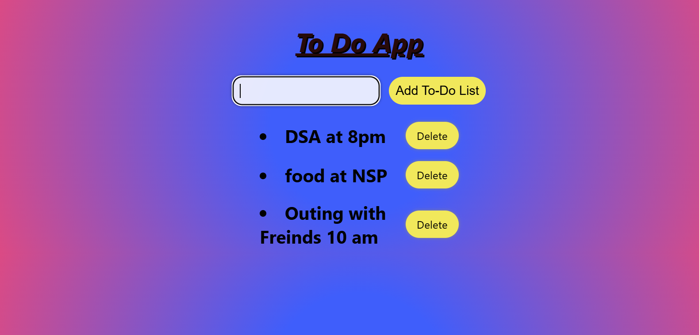

# 📝 To-Do App

A Advanced and beautiful **To-Do List Web App** that allows users to add, view, and delete their tasks. Tasks are saved in the browser's **local storage**, so they stay even after refreshing the page.

---

## 📸 Screenshot

---

## ✨ Features

- ➕ Add new tasks
- 🗑️ Delete tasks
- 💾 Saves data using LocalStorage (persists even after page refresh)
- 🎨 Clean and colorful UI with gradient background

---

## 🛠️ Tech Stack

- HTML5
- CSS3
- JavaScript (Vanilla)
- LocalStorage API

👨‍💻 Author
Pranav Aggarwal
GitHub
